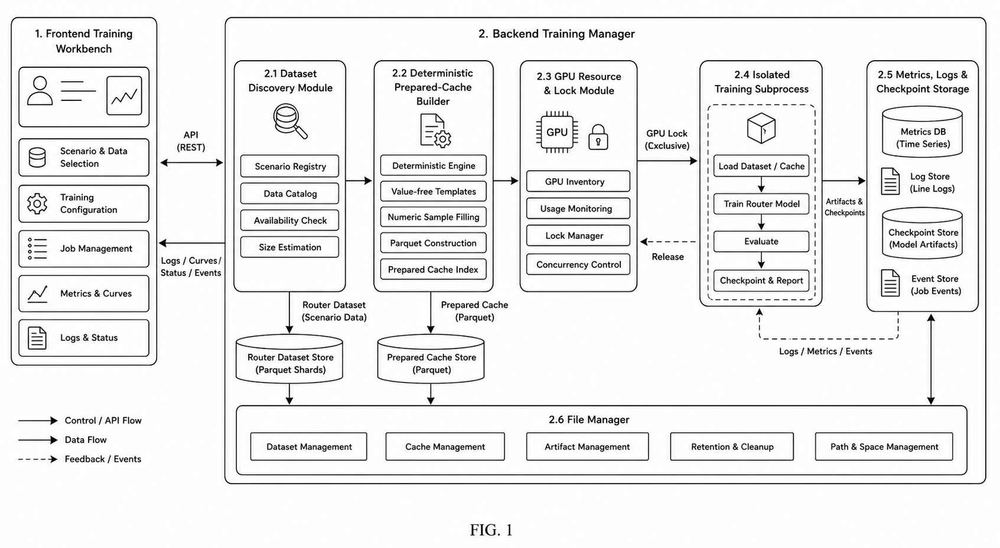
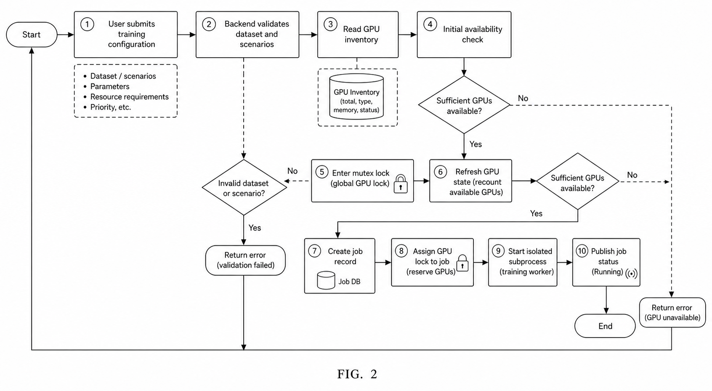
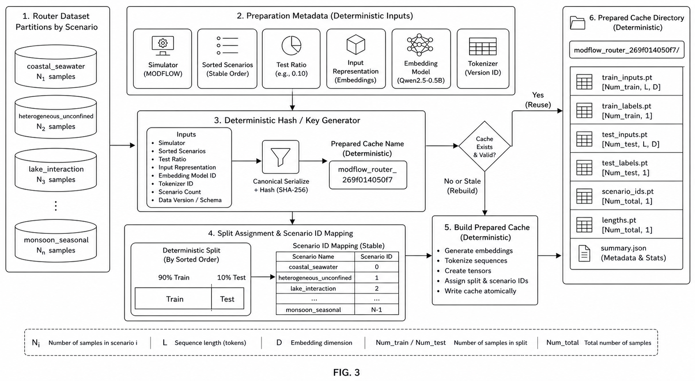
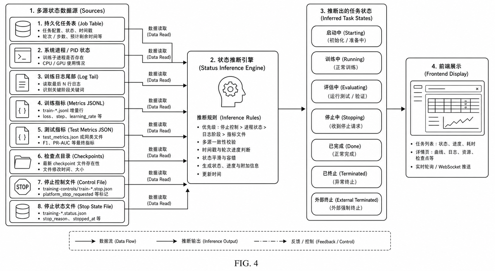
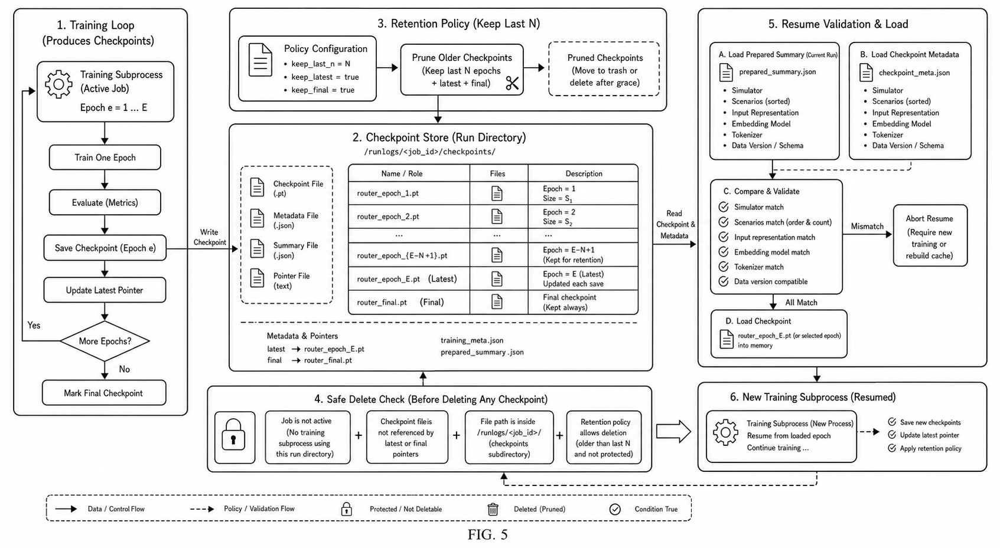

# 自动训练平台正式专利文本草案

文件性质：工程技术版专利草案，供后续专利代理人进行法律措辞、权利要求层级和创造性论证优化。

## 发明名称

一种面向科学仿真语言路由器的自动化训练调度、监控与权重管理方法、系统、设备及存储介质

## 摘要

本发明公开了一种面向科学仿真语言路由器的自动化训练调度、监控与权重管理方法、系统、设备及存储介质。该方法包括：发现路由训练数据，并聚合仿真器、场景、样本数量、文件大小、输入表示和嵌入模型元数据；获取 GPU 显存占用、利用率和平台活跃训练任务，并在训练任务创建时对目标 GPU 执行可用性判定和逻辑锁定；根据仿真器、场景集合、测试比例、输入表示、嵌入模型和分词器生成确定性预处理缓存名称，构建或复用训练缓存；启动独立训练子进程，并设置 GPU 环境变量、运行目录、日志路径、停止令牌和停止控制文件；在训练过程中根据进程状态、训练日志、指标文件、测试结果、检查点文件和停止状态文件综合推断训练任务状态；按照用户配置保留最近 N 个 epoch 的权重，并在恢复训练前执行检查点兼容性校验。该方案将训练数据、GPU 资源、预处理缓存、训练进程、状态监控和权重管理绑定为可校验的自动训练闭环，能够提高远程科学路由模型训练的可复现性、可恢复性和资源利用安全性。

## 权利要求书

### 权利要求 1

一种面向科学仿真语言路由器的自动化训练调度、监控与权重管理方法，其特征在于，包括如下步骤：

S1，发现路由训练数据，并聚合与所述路由训练数据对应的仿真器、场景、样本数量、文件大小、输入表示和嵌入模型元数据；

S2，获取计算设备中的 GPU 资源状态，并结合平台内活跃训练任务判断目标 GPU 是否可用于新训练任务；

S3，接收训练配置，所述训练配置包括仿真器、场景集合、目标 GPU、训练轮次、测试比例、批大小、评估间隔、学习率、权重衰减、权重保留数量和恢复训练来源中的至少一种；

S4，根据所述训练配置和所述嵌入模型元数据生成确定性预处理缓存名称，并构建或复用与所述确定性预处理缓存名称对应的训练缓存；

S5，创建训练任务并启动独立训练子进程，所述训练子进程被设置有 GPU 环境变量、运行目录、日志路径、停止令牌和停止控制文件；

S6，在训练任务运行过程中，从操作系统进程状态、训练日志、训练指标、测试指标、检查点文件和停止状态文件中的至少两种信息源推断训练任务状态；

S7，根据所述权重保留数量保存和清理训练检查点，并在恢复训练前校验待恢复检查点与当前训练配置之间的兼容性。

### 权利要求 2

根据权利要求 1 所述的方法，其特征在于，步骤 S1 包括：扫描路由数据 manifest、便携式分区文件和兼容行式文本文件中的至少一种，并按照仿真器和场景聚合样本数量、文件大小、数据表示类型、聊天模板标识、嵌入模型名称和分词器名称。

### 权利要求 3

根据权利要求 1 所述的方法，其特征在于，步骤 S2 包括：读取 GPU 型号、显存总量、显存占用量、利用率和进程占用信息，并基于显存阈值、利用率阈值以及平台活跃训练任务列表判断 GPU 是否可用。

### 权利要求 4

根据权利要求 1 所述的方法，其特征在于，在创建训练任务时，对目标 GPU 执行加锁状态下的二次可用性校验，以阻止多个训练请求并发占用同一 GPU。

### 权利要求 5

根据权利要求 1 所述的方法，其特征在于，步骤 S4 中的确定性预处理缓存名称由仿真器、排序后的场景集合、测试比例、输入表示、嵌入模型名称和分词器名称计算得到。

### 权利要求 6

根据权利要求 1 所述的方法，其特征在于，所述训练缓存包括训练集与测试集切分信息、场景标识映射、样本标签、输入嵌入或 token 缓存、最大序列长度和预处理摘要。

### 权利要求 7

根据权利要求 1 所述的方法，其特征在于，步骤 S5 包括：为训练任务生成任务标识和运行目录，将训练命令、训练配置、目标 GPU、进程标识、日志路径和停止控制文件路径持久化保存，并通过环境变量限制训练子进程可见的 GPU。

### 权利要求 8

根据权利要求 1 所述的方法，其特征在于，步骤 S6 中推断的训练任务状态包括启动中、运行中、评估中、停止中、已完成、已终止和外部终止中的至少一种。

### 权利要求 9

根据权利要求 1 所述的方法，其特征在于，所述停止控制文件包含停止令牌；当平台接收到停止请求时，向所述停止控制文件写入与训练子进程环境变量匹配的停止令牌，并向训练子进程发送终止信号；所述训练子进程仅在停止令牌校验通过后执行安全停止处理。

### 权利要求 10

根据权利要求 1 所述的方法，其特征在于，步骤 S7 包括：在每个训练轮次或预设间隔保存检查点，维护最新检查点和最终检查点，并删除超过所述权重保留数量的早期检查点。

### 权利要求 11

根据权利要求 1 所述的方法，其特征在于，恢复训练前的兼容性校验包括比较仿真器、场景集合、输入表示、嵌入模型、分词器、场景标识映射和预处理摘要中的至少一种。

### 权利要求 12

一种面向科学仿真语言路由器的自动化训练调度、监控与权重管理系统，其特征在于，包括：

数据集聚合模块，用于发现路由训练数据并聚合仿真器、场景、样本数量和嵌入模型元数据；

GPU 资源模块，用于获取 GPU 资源状态并结合活跃训练任务执行可用性判定和逻辑锁定；

缓存构建模块，用于根据训练配置和嵌入模型元数据生成确定性预处理缓存名称并构建或复用训练缓存；

训练执行模块，用于启动独立训练子进程并维护训练任务的运行目录、日志和停止控制文件；

状态监控模块，用于根据多源运行信息推断训练任务状态并向前端提供日志、曲线和任务详情；

权重管理模块，用于保存、清理、删除和恢复训练检查点。

### 权利要求 13

一种计算设备，包括处理器和存储器，所述存储器中存储有计算机程序，其特征在于，所述计算机程序被所述处理器执行时实现权利要求 1 至 11 中任一项所述的方法。

### 权利要求 14

一种非暂态计算机可读存储介质，其上存储有计算机程序，其特征在于，所述计算机程序被处理器执行时实现权利要求 1 至 11 中任一项所述的方法。

## 说明书

### 技术领域

本发明涉及机器学习训练平台、科学仿真数据处理、GPU 资源调度、模型训练过程管理、检查点管理和前后端协同监控技术领域，尤其涉及一种面向科学仿真语言路由器的自动化训练调度、监控与权重管理方法、系统、设备及存储介质。

### 背景技术

在科学计算与大语言模型结合的应用中，通常需要训练路由模型，用于根据用户上下文判断是否需要调用某一专家模型或科学计算模块。此类路由模型的训练数据往往来自多种科学仿真场景，并包含正负样本、场景标签、聊天模板、嵌入模型和分词器元数据。与普通文本分类训练不同，科学仿真语言路由训练不仅依赖文本样本本身，还高度依赖数据来源、场景选择、输入表示方式、嵌入模型版本和预处理缓存。

在手工训练方式下，研究人员通常需要自行选择数据文件、手动指定 GPU、运行预处理脚本、启动训练命令、观察日志、保存权重并处理训练中断。该方式存在多方面问题：首先，不同实验可能使用不同数据子集、不同嵌入模型或不同测试比例，若缺少统一记录，实验难以复现；其次，在远程服务器上多个任务可能同时使用同一 GPU，导致显存冲突；再次，长时间训练可能因网络断开、终端关闭或进程异常而中断，平台难以判断任务真实状态；此外，训练过程中产生的检查点文件会持续增长，占用大量磁盘空间，恢复训练时若使用不兼容的检查点，还会导致模型结构或数据标签不匹配。

因此，需要一种将训练数据发现、GPU 资源判定、预处理缓存构建、训练进程启动、运行状态监控、安全停止和权重管理统一起来的自动化训练平台，以提高训练过程的可复现性、可靠性和远程运维效率。

### 发明内容

#### 发明目的

本发明的目的在于提供一种面向科学仿真语言路由器的自动化训练调度、监控与权重管理方法、系统、设备及存储介质，以解决现有技术中训练配置易漂移、GPU 资源易冲突、训练状态难恢复、检查点难管理和恢复训练兼容性不足的问题。

#### 技术方案

为实现上述目的，本发明提供一种自动化训练调度方法。该方法首先发现可用于训练的路由数据。路由数据可以以 manifest、便携式分区文件或行式文本文件形式存在。平台扫描上述数据后，按照仿真器和场景进行聚合，获得样本数量、文件大小、数据表示类型、聊天模板、嵌入模型名称和分词器名称。平台将该聚合结果提供给前端，使用户能够选择仿真器和场景集合。

平台随后获取 GPU 资源状态。平台可以通过系统命令或驱动接口读取 GPU 型号、显存总量、显存占用量、利用率和进程占用情况，并结合平台内部保存的活跃训练任务列表，判断某一 GPU 是否可用。为了避免并发请求同时占用同一 GPU，平台在创建训练任务时在互斥锁保护下再次校验目标 GPU 状态，只有二次校验通过时才允许创建训练任务。

用户通过前端提交训练配置。训练配置可以包括任务名称、仿真器、场景集合、目标 GPU、训练轮次、是否无限训练、批大小、测试批大小、测试比例、评估间隔、学习率、权重衰减、数据加载线程数、保留最近权重数量和恢复训练路径。后端对训练配置进行校验，确保场景存在、GPU 可用、数值参数处于有效范围，并确认本地嵌入模型或分词器可解析。

平台根据训练配置和数据元数据生成确定性预处理缓存名称。该名称可以由仿真器、排序后的场景集合、测试比例、输入表示、嵌入模型名称和分词器名称计算得到。当相同配置再次启动训练时，平台可以复用已有预处理缓存；当上述任一关键信息变化时，平台会生成新的缓存名称并重建缓存。训练缓存可以包括训练集和测试集切分、场景标识映射、标签数组、输入嵌入或 token 缓存、最大序列长度和预处理摘要。

在训练任务启动阶段，平台为任务生成任务标识和运行目录，构造训练命令，设置 GPU 环境变量，使训练子进程仅能看到指定 GPU。平台还为训练任务生成停止令牌和停止控制文件路径，并将任务配置、命令、运行目录、日志路径、进程标识和停止控制信息持久化保存。训练脚本启动后写入训练日志、训练指标、测试指标、分场景指标和检查点文件。

在训练过程中，平台周期性刷新任务状态。平台不是仅依赖内存状态，而是结合操作系统进程是否存活、训练日志尾部内容、训练指标文件、测试指标文件、停止状态文件、最新检查点和最终权重文件进行多源推断。例如，当进程存活且最近日志显示正在预处理时，状态可以推断为启动中或运行中；当测试指标正在生成时，状态可以推断为评估中；当停止控制文件存在且训练仍在保存检查点时，状态可以推断为停止中；当最终权重存在且进程退出时，状态可以推断为已完成；当持久化记录显示任务未完成但进程已消失时，状态可以推断为外部终止。

在权重管理方面，训练脚本按 epoch 或预设间隔保存检查点。平台根据用户配置的权重保留数量保留最近 N 个 epoch 的权重，并清理更早的 epoch 权重。同时，平台维护最新权重和最终权重，并为每个检查点保存必要元数据。当用户请求删除检查点时，平台确认对应任务不处于运行状态，并确认待删除路径位于训练运行目录之内。

在安全停止方面，平台接收到停止请求后，向停止控制文件写入停止令牌，并向训练子进程发送终止信号。训练子进程收到信号后读取停止控制文件，只有当停止令牌与环境变量中的令牌一致时，才执行平台授权的停止流程，包括在安全点保存检查点、写入停止状态并退出。若训练子进程未在预设时间内退出，平台可以执行后续强制终止策略。

在恢复训练方面，用户可以选择已完成或已停止任务的检查点作为恢复来源。平台在启动恢复训练前读取检查点元数据，并比较仿真器、场景集合、输入表示、嵌入模型、分词器、场景标识映射和预处理摘要等信息。只有兼容性校验通过后，平台才允许恢复训练，从而避免使用不匹配的检查点继续训练。

#### 有益效果

与现有技术相比，本发明至少具有以下有益效果：

1. 将路由数据、嵌入模型、GPU、缓存和训练进程绑定为可校验的启动契约，提高训练可复现性。
2. 通过 GPU 状态读取和平台活跃任务逻辑锁定，降低多任务显存冲突风险。
3. 通过确定性预处理缓存名称复用相同数据配置下的缓存，减少重复预处理开销。
4. 通过多源状态推断，在服务重启、浏览器关闭或终端断开后仍能恢复任务可见状态。
5. 通过令牌化停止控制文件，在训练安全点保存权重并减少非授权信号造成的误停止。
6. 通过最近 N 个 epoch 的权重保留策略，在保留恢复能力的同时降低磁盘占用。
7. 通过恢复训练兼容性校验，减少因数据、场景或嵌入模型不一致导致的训练错误。

### 附图说明

图 1 为本发明实施例提供的自动训练平台总体架构图。

图 2 为本发明实施例提供的训练任务创建与 GPU 锁定流程图。

图 3 为本发明实施例提供的路由训练数据到预处理缓存的构建流程图。

图 4 为本发明实施例提供的训练状态多源推断流程图。

图 5 为本发明实施例提供的检查点保存、清理、删除和恢复训练关系图。

### 具体实施方式

以下结合附图和实施例对本发明进行进一步说明。应当理解，以下实施例仅用于解释本发明，而不用于限定本发明的保护范围。在不冲突的情况下，以下实施例及实施例中的特征可以相互组合。

#### 实施例一：路由训练数据发现

平台扫描指定的数据目录。若存在 manifest，则优先读取 manifest 中记录的仿真器、场景、样本数量、文件大小、输入表示、聊天模板和嵌入模型元数据；若不存在 manifest，则扫描便携式分区文件或兼容 JSONL 文件，并从文件内容或伴随元数据中提取相同信息。

平台按照仿真器维度聚合数据集，并在每个仿真器下列出可训练场景。对于每个场景，平台记录样本数量、文件大小和数据来源路径。前端通过接口获取该列表后，显示可选择的仿真器和场景集合，并在用户提交训练任务前将场景集合发送给后端校验。

#### 实施例二：GPU 资源判定和逻辑锁定

平台周期性读取 GPU 状态，包括 GPU 编号、型号、显存总量、已用显存和利用率。平台还维护活跃训练任务表，每个活跃任务记录其占用的 GPU 编号。当用户请求启动新训练任务时，后端首先检查目标 GPU 的显存占用和利用率是否低于预设阈值，并检查目标 GPU 是否已被平台活跃任务占用。

为了避免多个请求同时通过初步校验，平台在训练任务创建流程中使用互斥锁。在锁内，平台再次刷新 GPU 状态并重新判断目标 GPU 是否可用。只有二次判断仍为可用时，平台才创建训练任务并将该 GPU 标记为被新任务占用。

#### 实施例三：确定性预处理缓存构建

对于同一仿真器、同一场景集合、同一测试比例、同一输入表示、同一嵌入模型和同一分词器，平台生成相同的预处理缓存名称。预处理缓存名称可以通过对上述字段序列化后计算哈希得到。若缓存目录已经存在且摘要完整，平台复用该缓存；若不存在或摘要不匹配，平台重新构建缓存。

缓存构建过程中，平台将路由样本划分为训练集和测试集，构建场景到整数标识的映射，生成标签数组，并根据输入表示生成嵌入缓存或 token 缓存。平台保存预处理摘要，摘要中包括样本数量、正样本数量、测试样本数量、最大序列长度、输入表示、嵌入模型、分词器和场景映射。

#### 实施例四：训练子进程启动

平台为每个训练任务生成任务标识，例如由时间戳或随机标识构成。平台创建运行目录和日志文件，构造训练命令，并设置环境变量。环境变量至少包括指定 GPU 可见性的变量和平台停止令牌。平台以独立子进程方式启动训练脚本，并记录子进程标识、命令、训练配置、运行目录、日志路径和停止控制文件路径。

训练脚本启动后，加载或构建预处理缓存，创建模型和优化器，按训练配置执行训练循环。训练脚本周期性写入训练日志和指标文件，并在评估间隔到达时写入测试指标和分场景指标。

#### 实施例五：训练状态多源推断

平台刷新任务详情时，首先读取持久化任务记录，然后检查子进程是否仍然存活。平台进一步读取训练日志尾部、训练指标文件、测试指标文件、停止状态文件和检查点目录。

若子进程存活且停止控制文件不存在，平台根据最新日志和指标判断任务为启动中、运行中或评估中。若停止控制文件存在且子进程仍存活，平台判断任务处于停止中。若子进程不存在且最终权重存在，平台判断任务已完成。若子进程不存在且停止状态文件存在，平台判断任务已安全停止。若持久化记录显示任务未完成但子进程不存在且不存在最终权重，平台判断任务为外部终止或异常终止。

通过上述方式，平台即使在前端刷新、服务重启或终端断开后，也可以通过磁盘状态和进程状态恢复训练任务的可见状态。

#### 实施例六：检查点保留和删除

训练脚本在每个 epoch 结束时保存 `router_epoch_k` 形式的检查点，并更新最新检查点。平台根据用户设置的保留数量 N，对 epoch 检查点按轮次排序，只保留最近 N 个，删除更早的检查点。若 N 为 0，则可以不保留 epoch 检查点，仅保留最新权重或最终权重。

当用户在文件管理或训练详情页请求删除某一检查点时，平台先检查对应训练任务是否处于运行状态。若任务仍在运行，则拒绝删除。若任务已结束，平台还校验待删除路径是否位于该任务运行目录内，防止误删其他文件。

#### 实施例七：安全停止和恢复训练

当用户请求停止训练时，平台将停止令牌写入停止控制文件，并向训练子进程发送终止信号。训练子进程捕获信号后读取停止控制文件，若文件中的停止令牌与环境变量中的令牌一致，则将停止请求标记为有效，并在当前安全点保存检查点、写入停止状态文件后退出。若停止令牌不一致，则忽略该信号或按非授权信号处理。

当用户请求恢复训练时，平台读取待恢复检查点中的配置和预处理摘要，并与当前训练配置进行比较。若仿真器、场景集合、输入表示、嵌入模型、分词器或场景标识映射不匹配，平台拒绝恢复训练并返回错误信息。若兼容性校验通过，平台将恢复检查点路径传递给训练脚本，训练脚本加载模型状态和优化器状态后继续训练。

#### 实施例八：前端训练工作台

前端训练工作台包括训练总览、新建训练、任务管理、任务详情、训练曲线、日志查看、GPU 状态和文件管理等页面。前端通过统一 API 获取数据集、GPU、任务、日志、曲线和检查点信息。用户可以在新建训练页面选择仿真器、场景集合、目标 GPU、训练参数和恢复来源；在任务详情页查看状态、指标、日志和权重文件；在文件管理页删除不再需要的历史权重。

通过前后端统一的数据模型，平台可以使用户看到的任务状态、GPU 占用、训练曲线、日志和文件保护状态与后端运行状态保持一致。

以上实施例说明了本发明在科学仿真语言路由器自动训练中的应用。本领域技术人员可以在不脱离本发明核心思想的前提下，对训练模型结构、缓存格式、GPU 获取方式、日志格式、前端展示方式和停止策略进行等同替换。
