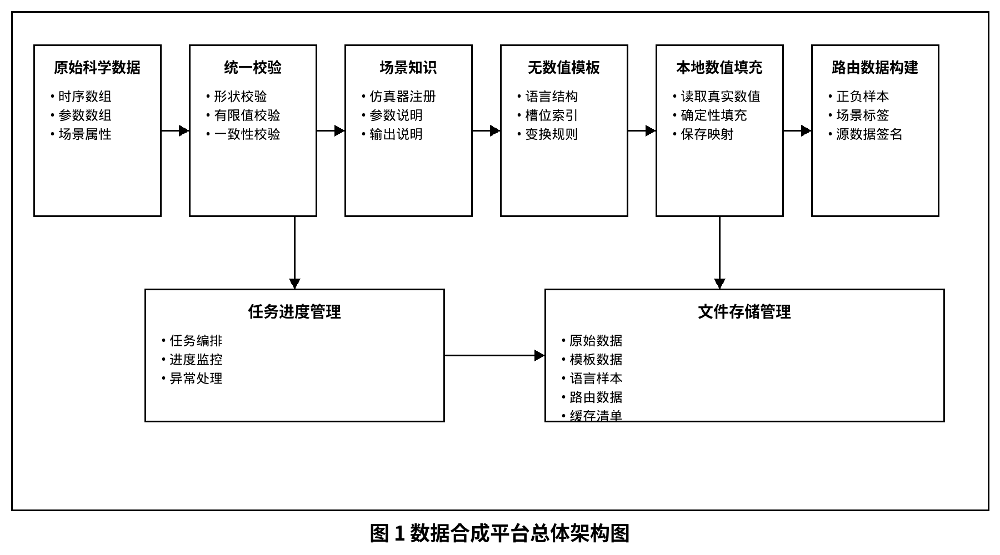
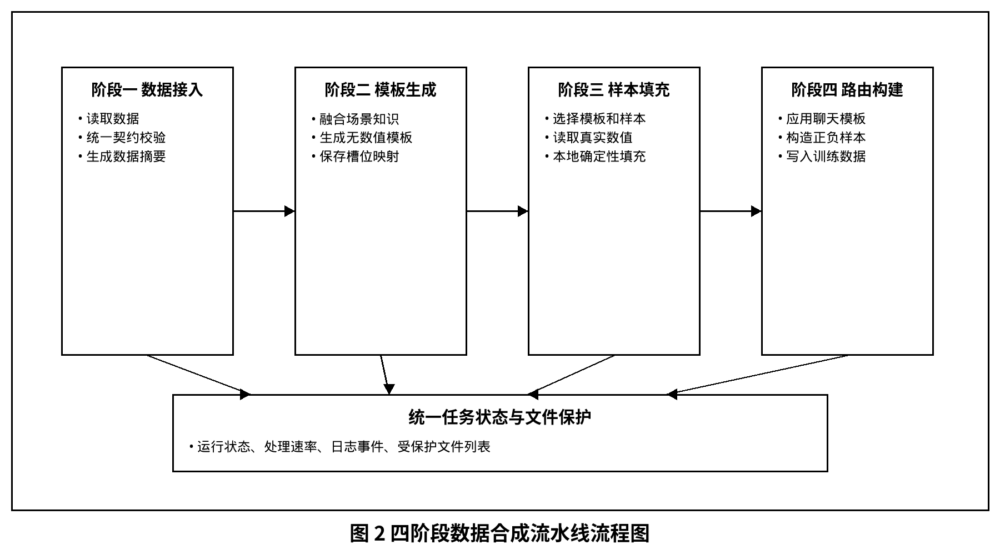
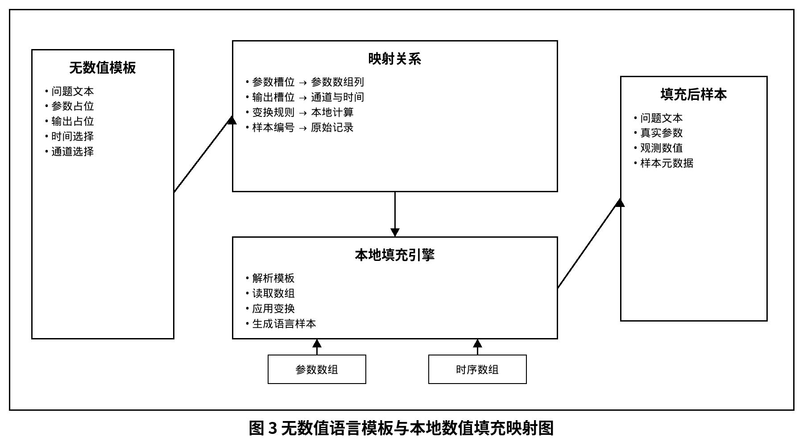
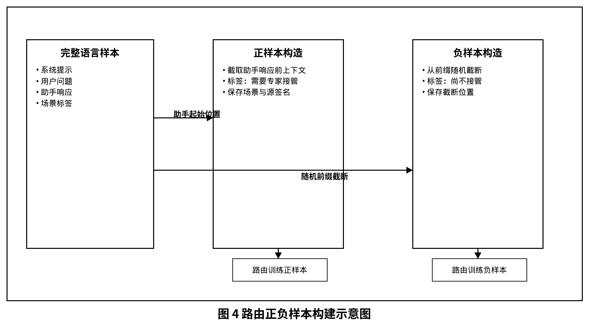
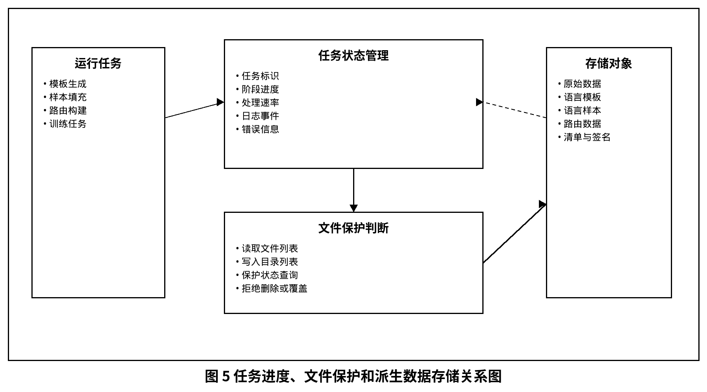

# 数据合成平台专利大纲

版本日期：2026-05-11

本文档是面向专利撰写的技术大纲，用于后续扩展为正式的说明书、权利要求书、摘要和附图说明。当前重点是固定可保护的技术方案边界，而不是撰写最终法律文本。

## 1. 拟定名称

一种科学仿真语言样本合成及路由数据构建方法、系统、设备及存储介质。

可选名称：

- 一种基于占位模板和本地数值填充的科学数据语言样本合成方法及系统。
- 一种跨仿真场景的科学时序数据文本化与路由样本构建方法。

## 2. 技术领域

本发明涉及科学计算数据处理、自然语言样本构建、机器学习训练数据生成、仿真数据管理和人机交互式数据工程平台，尤其涉及将多源科学仿真张量数据转换为可用于令牌路由器训练的语言样本和路由数据的方法及系统。

## 3. 背景问题

现有科学仿真数据通常以层次化科学数据文件、数组或表格形式保存，包含多通道时序、参数向量和场景元数据。若直接使用大模型逐条生成语言样本，通常存在以下问题：

- 逐样本调用大模型成本高、速度慢，难以扩展到百万级样本。
- 大模型直接写入数值容易产生物理不一致、单位不一致或参数映射错误。
- 不同仿真器的参数、通道、时间维度和观测方式差异大，缺少统一数据契约。
- 训练路由模型时需要同时构造正负样本、场景标签和嵌入元数据，人工处理容易出错。
- 远程服务器迁移时，派生数据、模板、原始科学数据和训练缓存之间的关系难以追踪。

## 4. 核心技术方案

该方案将数据合成平台拆分为四个相互约束的阶段，并通过统一任务系统、文件管理和进度接口串联：

1. 原始科学数据接入阶段：运行物理仿真或上传层次化科学数据文件，按统一契约校验 时序数组、参数数组和参数名称列表、属性字段、形状和有限值。
2. 语言模板生成阶段：融合仿真器注册表、场景元数据、参数说明、输出通道说明和观测配置，调用大模型生成不含真实数值的模板记录。
3. 本地样本填充阶段：根据模板中的占位符、参数槽位、输出槽位、时间索引、通道索引和变换描述，从层次化科学数据文件的数值数组中确定性填充语言样本。
4. 路由数据构建阶段：把填充后的语言样本转换为令牌路由器所需的正负训练样本，并保存场景、语言、嵌入模型和源数据签名等元数据。

## 5. 主要模块

### 5.1 数据契约与校验模块

- 统一检查 层次化科学数据文件中形状为样本数、通道数、时间步数的时序数组，参数数组和参数名称列表的一致性。
- 校验样本数、参数数、通道数、时间步、非法数值、属性字段和场景名称。
- 支持物理仿真生成数据和用户上传数据进入同一流程。

### 5.2 场景注册与领域知识融合模块

- 读取仿真器级注册表、场景级配置和内置领域注册表。
- 为每个场景组合 领域背景、输出描述、参数信息、输出信息和观测配置。
- 将不同仿真域的参数、输出通道和观测方式映射为统一模板输入。

### 5.3 无数值语言模板模块

- 模板仅包含语言结构、占位符、参数槽、输出槽、变换描述、时间选择和通道选择，不包含真实仿真数值。
- 每条模板记录保留仿真器、场景、语言、风格、时间模式、参数名称、输出名称、形状和观测配置。
- 支持不同语言、不同表述风格和参数变换描述。

### 5.4 本地数值填充模块

- 根据模板占位符从参数数组和时序数组中读取真实数值。
- 对参数值执行乘、除、加、减等变换，并同步记录原始参数和变换后参数。
- 按模板指定的时间点、通道和输出名称提取观测值，跳过非法索引和非有限值。
- 支持按场景并行填充、随机种子控制、批量写入和列式分区文件或行式文本文件 输出。

### 5.5 路由样本构建模块

- 对每条语言样本应用聊天模板，构造完整上下文。
- 从助手起始标记处构造正样本，表示当前上下文需要专家模型接管。
- 从前缀中随机截断构造负样本，表示上下文尚不需要专家模型接管。
- 记录场景标签、语言标签、源样本标识、聊天模板、嵌入模型、分词器和数据签名。

### 5.6 任务进度与文件保护模块

- 后端为模板生成、样本填充、路由构建等长任务维护任务状态、进度、统计速率、日志事件和互斥关系。
- 前端通过统一进度接口展示不同阶段的实时状态。
- 当样本填充、路由构建或训练任务正在使用数据时，对相关文件执行保护，避免删除或覆盖。

## 6. 关键创新点

- 将大模型生成从“逐样本生成”改为“生成可复用的无数值模板”，显著降低调用成本并提高可扩展性。
- 通过模板槽位、时间索引、通道索引和参数变换描述，将语言表达与真实科学数值严格绑定，减少虚假数值和物理不一致。
- 用统一数据契约和领域注册表屏蔽不同仿真器之间的输入输出差异，实现跨地下水模拟、电磁反演、电力潮流、暂态仿真和能源系统模拟等场景的统一合成。
- 在同一流水线中自动构建令牌路由器正负样本，使语言样本合成结果可直接服务下游路由训练。
- 通过源数据签名、清单文件、便携式列式分区文件和派生数据策略，提高远程迁移和重建能力。

## 7. 技术效果

- 将百万级语言样本生成的主要成本从大模型调用转移为本地数组填充和批量写入，提高吞吐量。
- 保证文本中的参数、观测值、时间点、通道和场景信息与原始层次化科学数据文件一致。
- 降低多仿真域接入成本，新场景可通过注册表和模板机制加入。
- 自动形成可训练的路由数据，减少人工构造正负样本的错误。
- 便于服务迁移，只需保存原始科学数据和语言模板即可重建派生样本和路由数据。

## 8. 权利要求布局建议

1. 独立方法权利要求：覆盖原始数据校验、领域元数据融合、无数值模板生成、本地数值填充和路由样本构建的完整流程。
2. 独立系统权利要求：覆盖数据接入模块、注册表模块、模板模块、填充模块、路由构建模块、任务管理模块和文件管理模块。
3. 设备权利要求：覆盖处理器执行上述方法的计算设备或服务器。
4. 存储介质权利要求：覆盖保存程序指令后执行上述方法的非暂态计算机可读存储介质。
5. 从属权利要求：分别保护占位符槽位、参数变换、时间/通道选择、正负路由样本构造、进度事件、源数据签名和便携式列式分区文件存储。

## 9. 附图建议

- 图 1：数据合成平台总体架构图。

  
- 图 2：四阶段流水线流程图。

  
- 图 3：无数值模板到本地数值填充的映射关系图。

  
- 图 4：路由正负样本构建示意图。

  
- 图 5：任务进度、文件保护和派生数据存储关系图。

  

## 10. 项目实现映射

- 合成接口：`piern/synth/api/routers/generation.py`、`piern/synth/api/routers/simulation.py`、`piern/synth/api/routers/router_data.py`
- 任务系统：`piern/synth/services/job_manager.py`
- 模板与填充：`piern/synth/text2comp/template_store.py`、`piern/synth/text2comp/generator.py`、`scripts/text2comp/fill_samples.py`
- 路由数据构建：`scripts/router/build_router_data.py`
- 前端工作台：`frontend/src/synth/`
