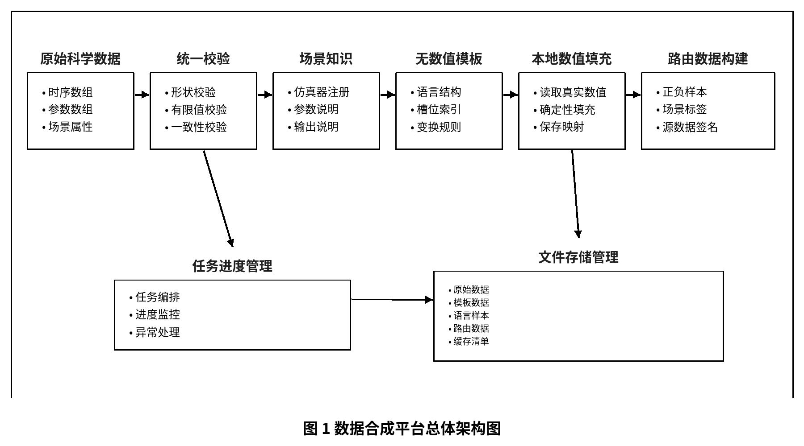
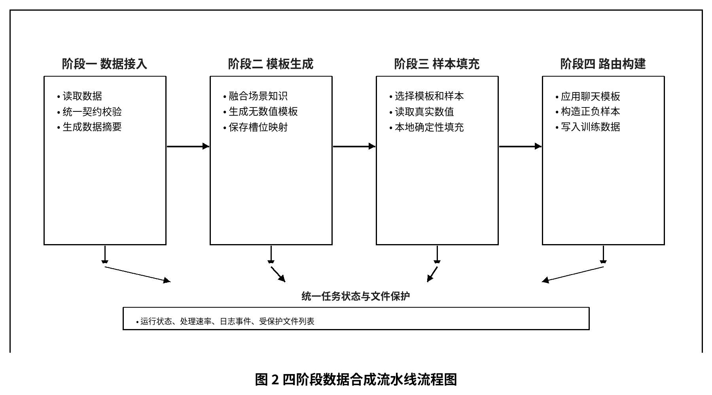
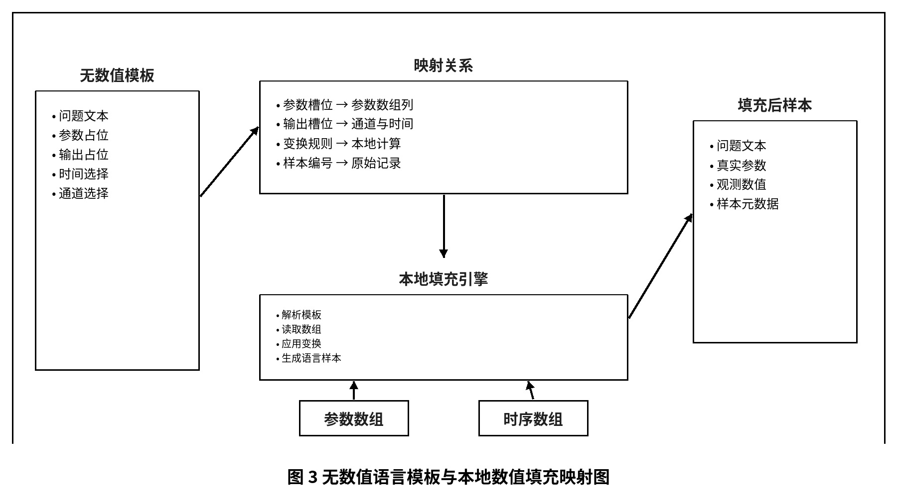
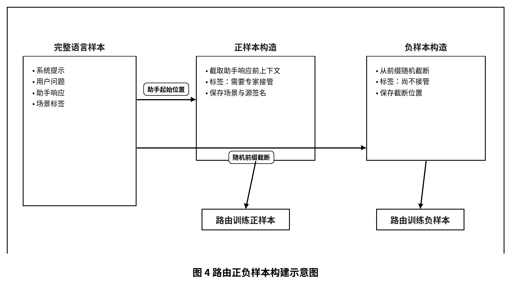
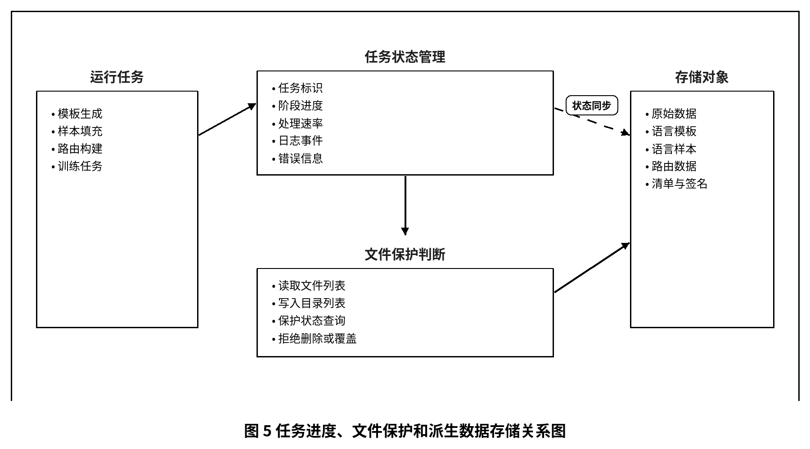

# 数据合成平台正式专利文本草案

文件性质：工程技术版专利草案，供后续专利代理人进行法律措辞、权利要求层级和创造性论证优化。本文档为可追溯源文件，Word 文件由脚本按需生成。

## 发明名称

一种科学仿真语言样本合成及路由数据构建方法、系统、设备及存储介质

## 摘要

本发明公开了一种科学仿真语言样本合成及路由数据构建方法、系统、设备及存储介质。该方法对多通道时序数组、参数数组和场景属性执行统一校验，融合仿真器注册信息生成场景知识对象；基于场景知识对象生成不含真实数值的语言模板；再在本地按参数槽位、输出槽位、时间索引和变换规则填充原始仿真数值，生成语言样本；最后应用聊天模板构造路由训练正负样本并保存源数据签名和场景标签。本发明将语言模型调用限制在模板阶段，使数值生成可校验、可复现并便于跨场景迁移。

## 权利要求书

### 权利要求 1

一种科学仿真语言样本合成及路由数据构建方法，其特征在于，包括如下步骤：

S1，获取科学仿真数据，并对所述科学仿真数据执行数据契约校验，所述科学仿真数据包括多样本多通道时序数组、参数数组、参数名称和场景属性；

S2，读取与所述科学仿真数据对应的仿真器注册信息和场景元数据，并融合参数说明、输出通道说明和观测配置，生成场景知识对象；

S3，基于所述场景知识对象生成不包含真实仿真数值的语言模板记录，所述语言模板记录包括语言文本结构、参数槽位、输出槽位、时间索引、通道索引和参数变换描述；

S4，根据所述语言模板记录，从所述科学仿真数据中读取真实参数值和真实观测值，并在本地按照槽位、索引和参数变换描述执行确定性填充，生成语言样本；

S5，根据所述语言样本构造路由训练数据，所述路由训练数据包括用于表示需要专家模型接管的正样本、用于表示尚不需要专家模型接管的负样本、场景标签和源数据元数据。

### 权利要求 2

根据权利要求 1 所述的方法，其特征在于，所述数据契约校验包括：校验所述多样本多通道时序数组为三维数组，校验所述参数数组为二维数组，校验参数名称数量与参数数组维度一致，校验样本数量在时序数组和参数数组之间一致，并校验所述科学仿真数据中不存在非有限数值。

### 权利要求 3

根据权利要求 1 所述的方法，其特征在于，所述场景知识对象包括领域背景、仿真器名称、场景名称、参数名称、参数物理含义、输出通道名称、输出通道物理含义、推荐观测时间和推荐观测通道中的至少一种。

### 权利要求 4

根据权利要求 1 所述的方法，其特征在于，所述语言模板记录中的参数槽位与参数数组中的参数索引对应，所述输出槽位与时序数组中的通道索引和时间索引对应，使语言文本中的占位符与原始科学仿真数据之间形成可追踪映射。

### 权利要求 5

根据权利要求 1 所述的方法，其特征在于，所述参数变换描述包括乘法、除法、加法和减法中的至少一种；在生成语言样本时，同步保存原始参数值、变换后参数值、变换规则和对应槽位标识。

### 权利要求 6

根据权利要求 1 所述的方法，其特征在于，步骤 S4 包括：根据随机种子确定语言模板记录与科学仿真数据样本之间的组合关系，按场景并行执行样本填充，并以批量方式写入列式分区文件或兼容行式文本文件。

### 权利要求 7

根据权利要求 1 所述的方法，其特征在于，步骤 S5 包括：对所述语言样本应用聊天模板，获得包括用户上下文和助手响应的完整上下文；以助手响应起始位置之前的上下文作为正样本输入，以从所述完整上下文前缀中随机截断得到的上下文作为负样本输入。

### 权利要求 8

根据权利要求 1 所述的方法，其特征在于，所述源数据元数据包括仿真器名称、场景名称、语言标识、源样本标识、聊天模板标识、嵌入模型名称、分词器名称、源科学仿真数据签名和语言模板签名中的至少一种。

### 权利要求 9

根据权利要求 1 所述的方法，其特征在于，所述方法还包括：为模板生成任务、样本填充任务和路由数据构建任务维护任务状态、进度事件、日志事件和处理速率；当任务正在使用数据文件或目录时，将所述数据文件或目录标记为受保护状态，以阻止删除或覆盖操作。

### 权利要求 10

一种科学仿真语言样本合成及路由数据构建系统，其特征在于，包括：

数据接入模块，用于获取科学仿真数据并执行数据契约校验；

场景知识模块，用于融合仿真器注册信息、场景元数据、参数说明、输出通道说明和观测配置；

语言模板模块，用于生成不包含真实仿真数值的语言模板记录；

本地填充模块，用于根据语言模板记录从科学仿真数据中读取真实数值并生成语言样本；

路由数据构建模块，用于根据所述语言样本构造路由训练数据；

任务与文件管理模块，用于维护任务状态、进度、日志和文件保护状态。

### 权利要求 11

一种计算设备，包括处理器和存储器，所述存储器中存储有计算机程序，其特征在于，所述计算机程序被所述处理器执行时实现权利要求 1 至 9 中任一项所述的方法。

### 权利要求 12

一种非暂态计算机可读存储介质，其上存储有计算机程序，其特征在于，所述计算机程序被处理器执行时实现权利要求 1 至 9 中任一项所述的方法。

## 说明书

### 技术领域

本发明涉及科学计算数据处理、自然语言样本构建、仿真数据管理、机器学习训练数据生成以及人机交互式数据工程平台技术领域，尤其涉及一种将多源科学仿真张量数据转换为语言样本并进一步构建路由训练数据的方法、系统、设备及存储介质。

### 背景技术

地下水模拟、电磁反演、电力潮流、暂态仿真、能源系统模拟等科学计算任务通常会产生大量结构化仿真数据。该类数据常以层次化科学数据文件、数组或表格形式保存，通常包括参数向量、多通道时序输出、场景名称、采样配置和物理含义说明。随着大语言模型和专家模型协同推理的发展，需要将上述科学仿真数据转换为自然语言问答样本、解释样本或路由训练样本，以训练能够识别任务场景和调用专家模型的路由模型。

现有做法通常包括两类：第一类是人工编写模板后手动填充数值；第二类是直接调用语言模型逐条生成自然语言样本。前者难以覆盖多场景、多语言和多表述风格，维护成本高；后者虽然能够生成丰富文本，但在百万级样本规模下会带来高昂的模型调用成本，并且模型直接生成数值时容易产生单位不一致、参数错配、通道错配、物理意义不一致或虚构数值等问题。

此外，不同仿真器的数据形状、参数名称、输出通道、时间维度和观测习惯存在显著差异。若每个仿真器单独构建数据生成逻辑，会导致代码重复、数据格式不统一和下游训练难以复用。进一步地，路由模型训练需要将语言样本转换为正负样本、场景标签和嵌入元数据，人工构造容易出现上下文截断不一致、标签错误和源数据无法追踪的问题。

因此，需要一种能够在跨仿真场景下统一管理科学仿真数据、低成本生成大规模语言样本、保证文本数值与原始仿真数据一致，并自动构建路由训练数据的技术方案。

### 发明内容

#### 发明目的

本发明的目的在于提供一种科学仿真语言样本合成及路由数据构建方法、系统、设备及存储介质，以解决现有技术中逐样本调用语言模型成本高、生成数值不稳定、跨仿真域数据格式不统一、路由训练数据人工构造易出错以及派生数据迁移困难的问题。

#### 技术方案

为实现上述目的，本发明提供一种科学仿真语言样本合成及路由数据构建方法。该方法首先获取科学仿真数据，所述科学仿真数据可以由物理仿真程序生成，也可以由用户上传。所述科学仿真数据包括多样本多通道时序数组、参数数组、参数名称和场景属性。平台对所述数据执行统一契约校验，以确保样本数量、参数数量、通道数量、时间步数量、参数名称和数值有效性满足后续处理要求。

在完成数据校验后，平台读取仿真器注册信息和场景元数据。所述注册信息可以包括领域背景、场景描述、参数名称、参数物理含义、输出通道名称、输出通道物理含义、默认观测时间点、默认观测通道以及语言生成提示。平台将上述信息融合为场景知识对象。所述场景知识对象用于屏蔽不同科学仿真器之间的数据差异，使语言模板生成阶段能够使用统一输入。

随后，平台基于所述场景知识对象生成语言模板记录。与直接生成完整样本不同，所述语言模板记录不包含真实仿真数值，而是包含语言文本结构、参数占位符、输出占位符、参数槽位、输出槽位、时间索引、通道索引和参数变换描述。也就是说，语言模型或模板生成器只负责生成可复用的语言结构和数据引用关系，不负责生成具体数值。

在本地样本填充阶段，平台读取语言模板记录以及对应的科学仿真数据。对于参数占位符，平台根据参数槽位从参数数组中读取真实参数值；对于输出占位符，平台根据输出槽位、通道索引和时间索引从时序数组中读取真实观测值。若语言模板记录包含参数变换描述，则平台按照变换描述执行乘法、除法、加法或减法变换，并同时保存原始参数值和变换后参数值。若出现非法索引或非有限数值，则跳过对应样本或执行预设异常处理。

生成语言样本后，平台进一步构建路由训练数据。平台对语言样本应用聊天模板，形成用户上下文和助手响应组成的完整上下文。平台以助手响应起始位置之前的上下文构造正样本，表示该上下文已经到达需要专家模型接管的位置；同时从完整上下文前缀中随机截断构造负样本，表示该上下文尚未到达需要专家模型接管的位置。平台为每条路由训练数据保存场景标签、语言标签、源样本标识、聊天模板标识、嵌入模型名称、分词器名称和源数据签名，以支持后续训练、追踪和迁移。

在一种优选实施方式中，平台以阶段化流水线组织处理过程，包括原始科学数据接入阶段、语言模板生成阶段、本地样本填充阶段和路由数据构建阶段。每个阶段由后端任务管理模块维护任务状态、进度事件、日志事件、处理速率和任务互斥关系，前端通过统一接口展示任务进度和文件状态。

在一种优选实施方式中，本地样本填充阶段支持按场景并行执行，支持通过随机种子控制模板和数值样本的组合顺序，支持批量写入便携式列式分区文件，也支持写入兼容行式文本文件。平台还可生成源数据签名和清单文件，用于判断派生数据是否与原始科学数据及语言模板一致。

在一种优选实施方式中，当样本填充任务、路由数据构建任务或训练任务正在使用某一文件或目录时，平台将所述文件或目录标记为受保护状态，阻止用户在文件管理界面中删除或覆盖该文件或目录，从而避免长任务运行期间的数据损坏。

#### 区别特征与技术效果

与逐条调用语言模型生成完整样本的方案相比，本发明至少具有以下区别特征和对应技术效果：

1. 区别特征一：语言模型仅生成不含真实数值的模板记录。对应技术效果：避免语言模型虚构仿真数值，并降低百万级样本生成时的调用成本。
2. 区别特征二：模板记录保存参数槽位、输出槽位、时间索引、通道索引和变换描述。对应技术效果：使自然语言文本与原始仿真数组之间形成可追踪映射。
3. 区别特征三：真实数值由本地程序根据模板映射确定性读取和填充。对应技术效果：保证参数值、观测值、时间点和场景标签与原始科学仿真数据一致。
4. 区别特征四：语言样本在同一流水线中转换为路由训练正负样本。对应技术效果：减少人工构造路由样本时的截断错误和标签错误。
5. 区别特征五：任务管理与文件保护同步维护。对应技术效果：降低长任务运行期间误删数据文件或覆盖派生结果的风险。

#### 有益效果

与现有技术相比，本发明至少具有以下有益效果：

1. 将语言模型调用从逐样本生成改为无数值模板生成，降低大规模样本合成成本。
2. 真实数值由本地程序从原始科学仿真数据中读取并填充，能够保持参数、通道、时间点和观测值的一致性。
3. 通过统一数据契约和场景知识对象支持多种仿真器和多种科学场景，降低新增场景接入成本。
4. 通过参数槽位、输出槽位和变换描述，使语言表达和原始数值之间形成可追踪映射。
5. 自动构造路由训练正负样本和相关元数据，使合成结果可直接服务于路由模型训练。
6. 通过源数据签名、便携式列式分区文件和派生数据策略，提高远程服务器迁移和数据重建能力。

### 附图说明

图 1 为本发明实施例提供的数据合成平台总体架构图。

图 2 为本发明实施例提供的四阶段数据合成流水线流程图。

图 3 为本发明实施例提供的无数值语言模板与本地数值填充之间的映射关系图。

图 4 为本发明实施例提供的路由正负样本构建示意图。

图 5 为本发明实施例提供的任务进度、文件保护和派生数据存储关系图。

### 具体实施方式

以下结合附图和实施例对本发明进行进一步说明。应当理解，以下实施例仅用于解释本发明，而不用于限定本发明的保护范围。在不冲突的情况下，以下实施例及实施例中的特征可以相互组合。

#### 实施例一：科学仿真数据接入与校验

平台接收一个仿真器对应的多个场景数据文件。每个场景数据文件包括时序数组、参数数组、参数名称列表和场景属性。其中，时序数组表示多样本多通道时序输出，参数数组表示多样本参数向量集合，参数名称列表表示参数数组中各列对应的物理参数名称。

平台在接入数据时执行如下校验：校验时序数组是否为三维数组；校验参数数组是否为二维数组；校验时序数组与参数数组的样本数量是否一致；校验参数名称列表的长度是否与参数数组的参数维度一致；校验场景名称、通道数量、时间步数量和属性字段是否存在；校验数组中是否存在非法数值。若校验失败，平台拒绝该场景进入后续阶段，并返回明确错误信息。

通过该方式，不同来源的科学仿真数据在进入语言生成流程前被转换为统一的数据契约，从而为跨仿真器处理提供基础。

#### 实施例二：场景知识对象生成

对于每个通过校验的场景，平台读取仿真器注册信息和场景元数据。仿真器注册信息可以包含地下水、水文、电磁、电力或能源系统等领域背景；场景元数据可以包含场景名称、参数说明、输出通道说明、推荐观测时间和推荐输出通道。平台将上述信息整理为场景知识对象。

例如，在地下水模拟场景中，参数说明可以包括渗透系数、补给量、储水系数等；输出通道说明可以包括水头、流量或浓度等。平台将这些信息与场景描述组合后传递给语言模板生成模块，以便语言模板能够使用符合领域语义的表达。

#### 实施例三：无数值语言模板生成

语言模板生成模块根据场景知识对象生成模板记录。模板记录中可以包括用户问题模板、助手响应模板、参数槽位、输出槽位、时间选择信息、通道选择信息和参数变换描述。

例如，某一模板可以表示：“在给定第一参数值和第二参数值的条件下，观测井在指定时间步的水头为指定观测值。”其中，第一参数值和第二参数值分别指向参数数组中的两个参数，指定观测值指向时序数组中的某一通道和某一时间步。模板生成阶段不填入具体数值，因此同一模板可以复用于多个仿真样本。

若模板包含参数变换，则模板记录同时保存变换类型和变换参数。例如，当文本需要描述某一参数的百分比形式或缩放形式时，模板记录保存缩放系数，样本填充模块在本地执行相同变换。

#### 实施例四：本地确定性样本填充

样本填充模块读取模板记录和科学仿真数据。对于每一条待生成样本，模块选择一个模板记录和一个仿真样本编号。随后，模块根据模板记录中的参数槽位从参数数组中读取参数值，并根据输出槽位从时序数组中读取观测值。

在填充过程中，模块检查时间索引是否小于时间步数量，检查通道索引是否小于通道数量，检查读取到的数值是否为有限值。若检查通过，模块将数值格式化后填入语言文本，并保存结构化字段，包括原始参数值、变换后参数值、观测值、场景名称、模板标识和源样本标识。

在大规模生成时，平台可以按场景并行运行多个填充任务，每个任务分批写入输出文件。输出文件可以采用列式分区文件格式，以便后续快速扫描和迁移；也可以采用行式文本文件格式，以兼容已有文本处理工具。

#### 实施例五：路由训练数据构建

路由数据构建模块读取语言样本，并对每条语言样本应用预设聊天模板。聊天模板将语言样本转换为包括系统信息、用户消息和助手消息的上下文。模块识别助手消息起始位置，并基于该位置构造正样本。正样本的输入为助手消息起始位置之前的上下文，标签为正。

为构造负样本，模块在完整上下文中选择一个早于助手消息起始位置的截断点，截取该截断点之前的文本作为负样本输入，标签为负。通过同一语言样本构造正负样本，可以使路由模型学习在何种上下文阶段需要调用专家模型，以及在何种上下文阶段不应提前调用专家模型。

模块为每条路由训练数据保存元数据，包括仿真器、场景、语言、源样本标识、正负标签、聊天模板、嵌入模型、分词器和源数据签名。后续训练平台可直接读取这些路由训练数据进行模型训练。

#### 实施例六：任务管理和文件保护

平台为模板生成、样本填充和路由数据构建等长任务分配任务标识。任务管理模块记录任务类型、状态、进度、各场景处理数量、处理速率、日志事件和错误信息。前端工作台订阅或轮询这些状态，以展示当前阶段进度。

当某一任务正在读取或写入文件时，平台将相关文件标记为受保护。文件管理模块在删除或覆盖文件前查询保护状态，若文件被运行中的任务占用，则拒绝该操作并提示用户。通过该机制，可以避免用户在长任务执行过程中误删原始数据、模板、样本或路由数据。

以上实施例说明了本发明在科学仿真语言样本合成和路由训练数据构建中的应用。本领域技术人员可以在不脱离本发明核心思想的前提下，对数据格式、模板语言、输出文件格式、并行方式和前端展示方式进行等同替换。
